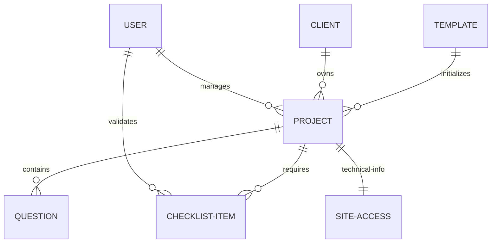

# ProfiWeb MVP: Development Status & Backend Strategy

This document outlines the current state of the **ProfiWeb** platform MVP, its database structure, and the roadmap for transition to **Clean Architecture**.

## 📊 Database Schema & Relationships

The platform uses a relational-style document schema in MongoDB to manage the complex project lifecycle.

### 1. Core Entities
*   **User**: `api/models/user.model.js` - Handles RBAC (`superadmin`, `admin`, `d.s`).
*   **Client**: `api/models/client.model.js` - Stores company details.
*   **Project**: `api/models/project.model.js` - Central entity tracking departmental gates.
*   **Question**: `api/models/question.model.js` - Dynamic project-specific items.
*   **QuestionTemplate**: `api/models/questionTemplate.model.js` - Global registry for dynamic fields.
*   **ChecklistItem**: `api/models/checklistItem.model.js` - Validation tasks for gated progress.
*   **SiteAccess**: `api/models/siteAccess.model.js` - Secure technical credentials storage.

### 2. Entity Relationship Diagram (Conceptual)


---
## 🚀 MVP Overview: Project Flow Management System

The ProfiWeb platform is a specialized project management tool designed for agency workflows. It automates the progression of projects through multiple specialized departments with strict validation gates.

### 1. Core Workflow (Departmental Lifecycle)
A project moves through the following stages, each mapped to specific user roles:

*   **Sales (`d.s`)**: Initial project intake, budget definitions, and client assignment.
*   **Info (`d.i`)**: **Dynamic Questionnaire** management. Information is gathered from the client using a structured, admin-configurable system.
*   **Content (`d.c`)**: Content drafting and automated/manual **Validation Checklists**.
*   **IT (`d.it`)**: Infrastructure setup and technical integration validation.
*   **Design (`d.d`)**: Visual creation (only accessible after Content and IT gates are cleared).
*   **Control Manager (`c.m`)**: Final quality assurance and confirmation.

### 2. Key MVP Pillars

#### A. Dynamic Questionnaire System (Implemented & Refactored ✅)
*   **Central Service**: `api/services/projectQuestionService.js` (Orchestrates bulk updates & PDF triggers)
*   **Logic Hub**: `api/services/questionService.js` (Filtering, grouping, and stats)
*   **Global Registry**: `api/services/questionTemplateService.js` (Syncs dynamic fields to global template)
*   **PDF Console**: `api/utils/pdfGenerator.js` & `api/utils/aistructorpdfgenerator.js`
*   **Visibility Rules**: Admin-set visibility and "empty-answer" filters strictly applied at service level.

##### Multi-language help popup (`?`) and custom fields
*   **Shared popup component**:  
    * `app/app/[lang]/(dashboard)/projects/[id]/components/FieldDescriptionPopout.jsx`  
    * Re-exported for legacy questionnaire: `app/components/questions/FieldDescriptionPopout.jsx`
*   **Translation sources**:  
    * Static registry for built‑in fields: `app/app/[lang]/(dashboard)/projects/[id]/components/questionTranslations.js`  
    * Custom per‑field translations (admin-created fields) are stored on each question as `question.translations` (EN/FR/AR/DE) via `DynamicSection` → `onAddCustomField`.
*   **Where the `?` icon appears**:  
    * Project questionnaire: `DynamicField.jsx` (always visible for all roles; falls back to label text if no translation is defined).  
    * Legacy WordPress questionnaire: `app/components/questions/QuestionRenderer.jsx` (same behavior).

##### PDF visibility rules (hidden fields & sections)
*   **Persistence of visibility flags**: questions store `isVisible` (field) and `isSectionVisible` (section) in `api/models/question.model.js`. Admins toggle these from the UI via:
    * Section-level toggle: `DynamicSection.jsx` → `onToggleSection` → `toggleQuestionVisibility()` in `app/config/functions/project.js`.
    * Field-level toggle: `DynamicField.jsx` → `onToggleVisibility` → same API.
*   **PDF generation entry points**:
    * Auto generation on questions save: `api/controllers/projectController.js` → `createOrUpdateQuestions` (with `generatePDFs` flag).  
    * Auto generation on Info completion: `api/controllers/projectController.js` → `completeInfoQuestionnaire`.  
    * Manual regeneration: `api/controllers/pdfController.js` → `generatePDFsForProject` (`api/routes/pdf.routes.js`).
*   **Filtering logic before PDF creation** (applied in all three places above):
    * Hidden fields/sections are excluded: only questions with `isVisible !== false` **and** `isSectionVisible !== false` are passed to the PDF generator.  
    * Unanswered questions are excluded: only questions with `status === "answered"` or a non‑empty `answer` string are included.  
    * The special `"Selected Template"` question is always preserved so template lookup still works.
*   **PDF storage & folders**:
    * AI instructions PDFs: generated via `api/utils/aistructorpdfgenerator.js` and stored as `File` docs under the `Folder` named **"Generated instructions pdf"`.  
      * Creation/update logic: `api/controllers/projectController.js` (`createOrUpdateQuestions`, `completeInfoQuestionnaire`).  
    * Content PDF: `api/controllers/projectController.js` → `submitContent` uses `generateFormattedContentPdf()` and stores into folder **"Formatted content pdf"`.  
    * All folders and files are surfaced to users via:
      * API helpers: `app/config/functions/folder.js`  
      * UI: `app/app/[lang]/(dashboard)/projects/[id]/FoldersTab.jsx` (includes special treatment for the “Generated instructions pdf” / “Structured content json” folders).

#### B. Departmental Workflow & Checklist (Implemented & Refactored ✅)
*   **Workflow Engine**: `api/services/projectWorkflowService.js` (Manages department gates, locks, and automatic departmental progression)
*   **Checklist Hub**: `api/services/checklistService.js` (Encapsulates project-specific validation tasks)
*   **RBAC Filter**: `ProjectService.listProjects` now natively filters by user role and department visibility gates.

#### C. File & Folder Management (Implemented & Refactored ✅)
*   **File Persistence**: `api/services/projectFileService.js` (Mapping DB to physical storage)
*   **Structure Service**: `api/services/folderService.js` (Folder lifecycle + physical cleanup)
*   **Content Logic**: `api/services/projectContentService.js` (Handles drafts, final submissions, and background JSON/PDF generation)

#### D. Core Resource Management (Implemented & Refactored ✅)
*   **Project CRUD**: `api/services/projectService.js` (Clean separation from controllers)
*   **Client Hub**: `api/services/clientService.js` (Validation, normalization, and population)

---

## 🏗️ Technical Architecture: Service-Oriented (Transitioning ✅)

We have successfully moved from a "Fat Controller" MVC pattern to a **Service Layer Architecture**:
*   **Controllers**: Now lean, focusing on request validation and response formatting.
*   **Services**: Encapsulate all business rules, database interactions, and cross-model orchestrations.
*   **Models**: Continue to define schemas but are used by services, not direct controller injection.
*   **Benefit**: High testability, clear separation of concerns, and reusable logic across different entry points.

---

## 🏗️ Future Goal: Full Clean Architecture (Domain-Driven)

To make the backend scalable and testable, we will move towards a dependency-rule-driven architecture.

### 1. Layers Definition
We will organize the code into four distinct layers:

1.  **Entities (Domain Layer)**: Pure JavaScript objects/classes representing business rules (e.g., `Project`, `User`). No knowledge of Mongoose or Express.
2.  **Use Cases (Application Layer)**: Orchestrates the flow of data. Contains the specific logic for "Create Project", "Validate Checklist", etc.
3.  **Interface Adapters (Storage/Delivery Layer)**:
    *   **Repositories**: Implementations of data access (Mongoose wrappers).
    *   **Controllers**: Map HTTP requests to Use Cases.
4.  **Frameworks & Drivers**: Express, MongoDB, Cloudinary, etc.

### 2. Implementation Roadmap

#### Phase 1: Folder Restructuring
Create a new directory structure within `api`:
```bash
api/src/
  ├── domain/         # Entities & Interface Definitions
  ├── application/    # Use Cases
  ├── infrastructure/ # Repositories, DB Models, External Services
  └── web/            # Express Routes, Controllers, Middlewares
```

#### Phase 2: Implementation of Dynamic Engines
Moving questionnaires and checklists into the Domain layer:
*   **Entity Definition**: Create `Question` and `ChecklistItem` entities with visibility and status tracking.
*   **Visibility Logic**: Add `isVisible` property to the Question entity to allow Admin control over partial display.
*   **Group Logic**: Implement grouping services that aggregate questions by `sectionId`.

#### Phase 3: Decoupling Use Cases
Start with the most complex logic (e.g., `projectController.js`).
*   Extract the "Permission Gate" logic into a Domain Service.
*   Extract the "Project Progression" logic into an Application Use Case.

#### Phase 3: Repository Pattern
Instead of calling `Project.find()` in controllers:
1.  Define a `ProjectRepository` interface.
2.  Create a `MongooseProjectRepository` implementation.
3.  Inject the repository into the Use Case.

---

## 📋 Frontend "Full Backend Sync" List (Upcoming 🚀)

1.  **Refactor API Layer**: Update `app/config/functions/*.js` to use a more standardized response handler that matches the backend's new consistency.
2.  **State Management**: Move from local `useState` in complex tabs (like `FoldersTab.jsx` and `ChecklistTab.jsx`) to a more robust React Query cache management to handle background PDF generation feedback.
3.  **Real-time Handover UI**: Implement visual notifications or "pulse" effects when a project moves from one department to another (e.g., when Info marks as Complete).

## 📋 Backend Final MVP List

1.  **Notification Engine**: Create a lightweight service to notify team members (via UI or Email) when a project lands in their department queue.
2.  **File Cleanup Worker**: Implement a service to delete physical files from `uploads/` when their corresponding database entries are deleted or overwritten.
3.  **Dashboard Analytics**: Provide admins with a "Bottleneck Report" showing how long projects spend in each department gate.
4.  **Audit Logs**: Implement `AuditService` to track "Who did what and when" for every gate transition.
5.  **Environment Robustness**: Securely manage storage paths and sensitive credentials using a centralized configuration service.
6.  **Production Deployment Strategy**: Finalize PM2/Docker configuration for the API and frontend nodes.

---

> [!TIP]
> **Priority #1**: Start by refactoring `Project` creation and its department assignment logic into a Use Case. This is the heart of the MVP.
